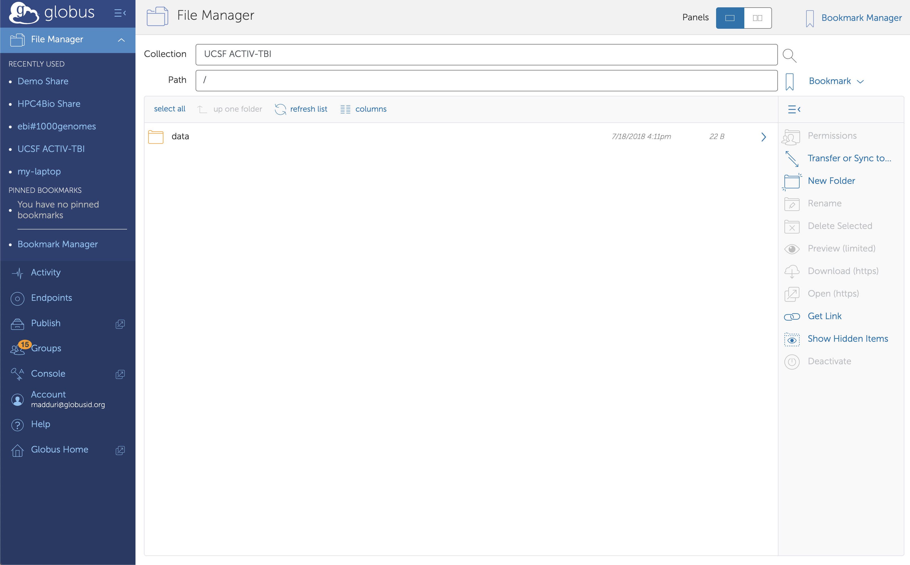

Instructions for Data access using Globus

1. If you don't already have a Globus account, please following instructions here: https://docs.globus.org/how-to/get-started/. If you already have a Globus account but it is not associated with your institution, use the following instructions to link your institutional identity with existing Globus account: https://docs.globus.org/how-to/link-to-existing/

2. Access to the Globus endpoints at UCSF, ANL and LLNL are controlled by a Globus Group called TBI-ACTIV. Membership to this group can be requested using this link: https://app.globus.org/groups/9462e2fa-2c65-11e8-9ef5-0a7c735d220a/about - Alternatively, you can send an email to madduriATanl.gov with your globus id to be added to this group. You will get a confirmation after you are added to the Globus group.

3. Once added, you can check if you can access the data from the UCSF endpoint (UCSF ACTIV-TBI). This link has instructions on how to access the endpoint: https://docs.globus.org/how-to/get-started/. You will be using UCSF ACTIV-TBI as the name of Collection instead of globus tutorial endpoint. 

4. Setting up a Globus endpoint on a personal laptop: Please follow these instructions on setting up a Globus endpoint on  laptop so one can upload/download data from other Globus endpoints:
* [OS X] (https://docs.globus.org/how-to/globus-connect-personal-mac/)
* [Windows] (https://docs.globus.org/how-to/globus-connect-personal-windows/)
* [Linux] (https://docs.globus.org/how-to/globus-connect-personal-linux/)

5. Please direct any issues with Globus to support@globus.org

